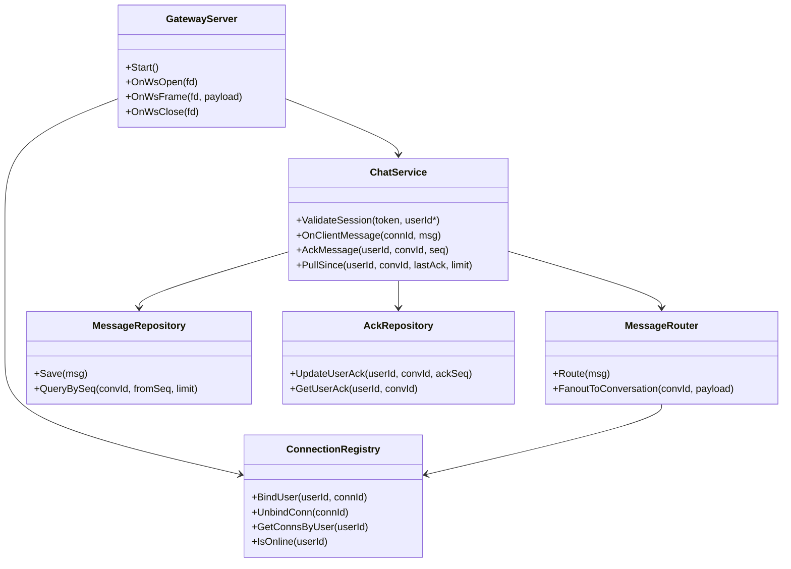
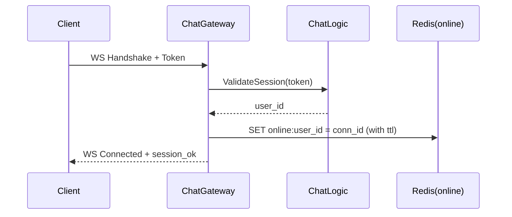
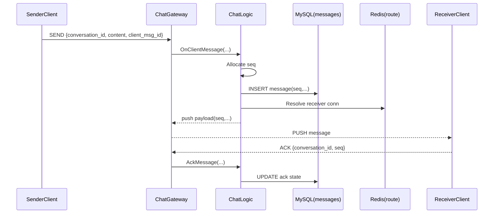
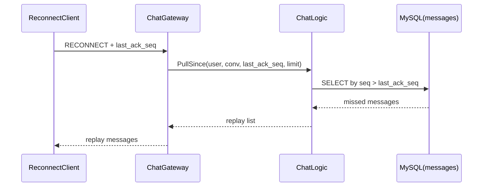

# Chat 系统扩展蓝图（基于 myWebServer）

## 1. 这算微服务架构吗？

### 1.1 当前项目结论
当前项目是 **模块化单体（Modular Monolith）**，不是微服务。

依据：
- 单一可执行进程（`server`）承载全部功能。
- 模块（`http`、`epoller`、`timer`、`log`）是进程内调用，不是跨服务网络调用。
- 没有独立服务的部署/扩缩容边界。

### 1.2 你接下来可采用的形态
在一台机器上也可以做“微服务化验证”，建议分两层理解：
- **架构形态上**：按微服务边界拆分职责（网关、会话、消息、存储、状态）。
- **部署形态上**：先单机多进程/多容器模拟分布式。

这通常称为：**单机部署的微服务架构（Pseudo-distributed Microservices）**。

---

## 2. 推荐目录设计（先不改现有代码）

> 目标：保留当前 `server`，新增聊天子系统目录，逐步迁移共性网络能力。

```text
myWebServer/
├─ apps/
│  ├─ web_server/                   # 现有 HTTP 服务（保留）
│  ├─ chat_gateway/                 # WebSocket 接入层，连接管理，心跳，推送
│  │  ├─ include/
│  │  │  ├─ gateway_server.h
│  │  │  ├─ ws_session.h
│  │  │  └─ connection_registry.h
│  │  └─ src/
│  │     ├─ gateway_server.cpp
│  │     ├─ ws_session.cpp
│  │     └─ connection_registry.cpp
│  ├─ chat_logic/                   # 聊天业务层（路由、鉴权、ACK、重放）
│  │  ├─ include/
│  │  │  ├─ chat_service.h
│  │  │  ├─ message_router.h
│  │  │  └─ sync_service.h
│  │  └─ src/
│  │     ├─ chat_service.cpp
│  │     ├─ message_router.cpp
│  │     └─ sync_service.cpp
│  └─ admin_tools/                  # 可选：管理与巡检工具
│
├─ libs/
│  ├─ net_core/                     # 复用/抽取：epoll、buffer、timer
│  ├─ common/                       # 公共模型：消息结构、错误码、配置
│  ├─ storage/                      # MySQL/Redis 适配层
│  └─ observability/                # metrics、trace、structured log
│
├─ deploy/
│  ├─ docker-compose.yml            # 单机多实例仿真部署
│  ├─ nginx/
│  │  └─ nginx.conf                 # 网关层负载均衡
│  └─ env/
│     ├─ dev.env
│     └─ benchmark.env
│
├─ protocols/
│  ├─ ws_message.proto              # 若后续转 protobuf
│  └─ json_schema/                  # 当前可先 JSON 协议
│
└─ docs/
   ├─ chat-architecture-blueprint.md
   └─ chat-api-contract.md
```

---

## 3. 核心接口草案（MVP）

> 语言保持 C++ 风格，先定义边界，再填实现。

### 3.1 网关层接口

```cpp
struct ClientContext {
    uint64_t conn_id;
    uint64_t user_id;
    std::string device_id;
    std::string session_token;
    int fd;
    std::chrono::steady_clock::time_point last_active;
};

class IConnectionRegistry {
public:
    virtual ~IConnectionRegistry() = default;
    virtual bool BindUser(uint64_t user_id, uint64_t conn_id) = 0;
    virtual void UnbindConn(uint64_t conn_id) = 0;
    virtual std::vector<uint64_t> GetConnsByUser(uint64_t user_id) = 0;
    virtual bool IsOnline(uint64_t user_id) = 0;
};

class IRealtimePush {
public:
    virtual ~IRealtimePush() = default;
    virtual bool PushToConn(uint64_t conn_id, std::string_view payload) = 0;
    virtual size_t PushToUser(uint64_t user_id, std::string_view payload) = 0;
};
```

### 3.2 聊天业务层接口

```cpp
enum class ChatMsgType {
    TEXT,
    IMAGE,
    SYSTEM,
    ACK,
    HEARTBEAT
};

struct ChatMessage {
    std::string msg_id;      // 全局唯一
    uint64_t conversation_id;
    uint64_t sender_id;
    uint64_t receiver_id;    // 群聊可置 0，使用 conversation_id 路由
    uint64_t seq;            // 会话内递增序号
    ChatMsgType type;
    std::string content;
    int64_t client_ts_ms;
    int64_t server_ts_ms;
};

class IChatService {
public:
    virtual ~IChatService() = default;
    virtual bool ValidateSession(const std::string& token, uint64_t* user_id) = 0;
    virtual bool OnClientMessage(uint64_t conn_id, const ChatMessage& in_msg) = 0;
    virtual bool AckMessage(uint64_t user_id, uint64_t conversation_id, uint64_t seq) = 0;
    virtual std::vector<ChatMessage> PullSince(uint64_t user_id, uint64_t conversation_id, uint64_t last_ack_seq, size_t limit) = 0;
};

class ISequenceAllocator {
public:
    virtual ~ISequenceAllocator() = default;
    virtual uint64_t NextSeq(uint64_t conversation_id) = 0;
};
```

### 3.3 存储接口

```cpp
class IMessageRepository {
public:
    virtual ~IMessageRepository() = default;
    virtual bool Save(const ChatMessage& msg) = 0;
    virtual std::vector<ChatMessage> QueryBySeq(uint64_t conversation_id, uint64_t from_seq_exclusive, size_t limit) = 0;
};

class IAckRepository {
public:
    virtual ~IAckRepository() = default;
    virtual bool UpdateUserAck(uint64_t user_id, uint64_t conversation_id, uint64_t ack_seq) = 0;
    virtual uint64_t GetUserAck(uint64_t user_id, uint64_t conversation_id) = 0;
};
```

---

## 4. 类图（逻辑结构）



---

## 5. 消息流（关键路径）

### 5.1 长连接建立与在线状态



### 5.2 实时发消息 + 持久化 + ACK



### 5.3 断线重连与消息同步



---

## 6. 单机“多机化”部署建议

- 组件实例数：
  - `chat_gateway`: 2~4 实例
  - `chat_logic`: 1~2 实例
  - `redis`: 1 实例
  - `mysql`: 1 实例
  - `nginx`: 1 实例（四层/七层都可）
- 在同一台机器上通过容器网络模拟跨服务调用。
- 压测优先验证：连接稳定性、P99 推送延迟、断线补偿成功率、ACK 丢失率。

---

## 7. 演进顺序（推荐）

1. 单进程 MVP：WS + 私聊 + ACK + 重连补偿。
2. 单机多实例：网关横向扩展，在线状态放 Redis。
3. 服务拆分：`chat_logic` 独立进程，网关只做接入和转发。
4. 高并发优化：多 Reactor、批量写、热点会话分片。

---

## 8. 最小数据模型草案

- `messages`
  - `id`, `conversation_id`, `seq`, `sender_id`, `payload`, `created_at`
  - 索引：`(conversation_id, seq)`
- `user_conversation_ack`
  - `user_id`, `conversation_id`, `ack_seq`, `updated_at`
  - 主键：`(user_id, conversation_id)`
- `conversation_members`
  - `conversation_id`, `user_id`, `role`, `joined_at`

该模型保证“可重放、可对账、可补偿”，是实时聊天系统最关键的正确性基础。
